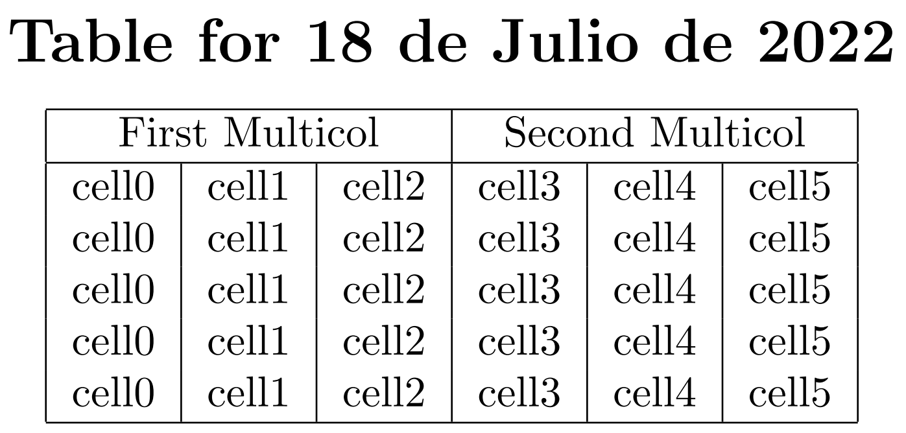

# Django-Tex Syntax Highlighting Extension

The **Django-Tex Syntax Highlighting** extension (`vscode-django-tex`) is a simple *VSCode* extension for syntax highlighting in [`django-tex`](https://github.com/weinbusch/django-tex) (`.tex`) templates. The extension is based on another extension called [Django](https://github.com/vscode-django/vscode-django), which does the same for `.txt` and `.html` templates, so credits to [@batisteo](https://github.com/batisteo) for that.


## Features

* Syntax Highlighting in [`django-tex`](https://github.com/weinbusch/django-tex) (`.tex`) templates:

    

    <details>
    <summary>
    <b>Rest of the example code</b>
    </summary>

    Template code:

    ```
    \documentclass{article}

    \begin{document}

        \begin{center}

            \section*{Table for {{date|date}} }

            \begin{tabular}{ 
                |c| 
                } 

                {# This is a comment #}
                \hline
                % This is another comment
            
                \multicolumn{
                    {{table.headers.first.span}}
                    }{|c|}{ {{table.headers.first.value}} } & 
                \multicolumn{ 
                    {{table.headers.second.span}} 
                    }{c|}{ {{table.headers.second.value}} } \\ 
                
                \hline

                \iffalse 
                This is a comment spanning several lines
                \hline \fi
                
                
                 &
                 cell{{cell}}  \\
                

                
                This is another comment spanning several lines
                \hline 

                \hline
            
            \end{tabular}

        \end{center}

    \end{document}
    ```

    We could combine the code from the `django-tex` template with the following function based view to render the *LaTeX* document:

    ```python
    from django_tex.shortcuts import render_to_pdf
    from datetime import date

    def render_pdf(request):
            table = {
                'headers': { 
                    'first': {
                        'span': 3,
                        'value': 'First Multicol',
                    },
                    'second': {
                        'span': 3,
                        'value': 'Second Multicol',
                    },
                },
                'body': {
                    'rows': [
                        [i for i in range(6)],
                        [i for i in range(6)],
                        [i for i in range(6)],
                        [i for i in range(6)],
                        [i for i in range(6)],
                    ]
                },
            }
            filename = 'filename.pdf'
            template_name = 'path/to/template_name.pdf'
            
            context = {
                'date': date.today(), 
                'table': table, 
            }

            return render_to_pdf(
                request, 
                template_name, 
                context, 
                filename,
            )
    ```

    This would produce:

    

    </details>


<!-- ## Requirements

If you have any requirements or dependencies, add a section describing those and how to install and configure them. -->

<!-- ## Extension Settings

Include if your extension adds any VS Code settings through the `contributes.configuration` extension point.

For example:

This extension contributes the following settings:

* `myExtension.enable`: enable/disable this extension
* `myExtension.thing`: set to `blah` to do something -->

<!-- ## Known Issues

Calling out known issues can help limit users opening duplicate issues against your extension. -->

## Release Notes

### Unreleased

#### Added
- Initial working version of the extension by [@bfrangi](https://github.com/bfrangi/).

-----------------------------------------------------------------------------------------------------------

<!-- ### For more information

* [Visual Studio Code's Markdown Support](http://code.visualstudio.com/docs/languages/markdown)
* [Markdown Syntax Reference](https://help.github.com/articles/markdown-basics/) -->

**Enjoy!**
